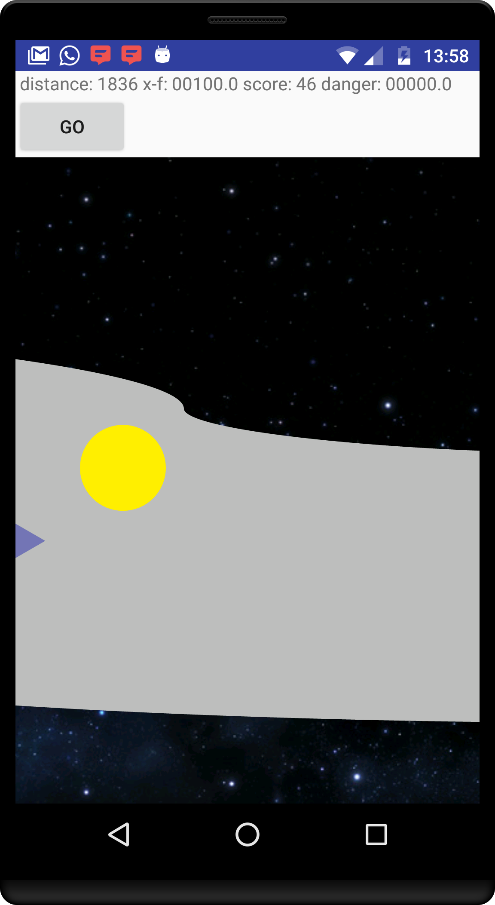
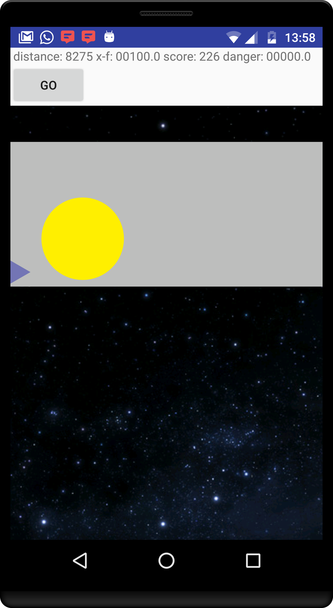

# humster
An Android game to train pitch control. Humming or singing - it's all the same to us!

## Instructions

### Calibration
First, calibrate the game to your voice.

Press two fingers anywhere on the screen and hum any comfortable note
*(PRO TIP: Just say 'mmmmmmm' like you're enjoying a hot buttered crumpet.
Don't try and "do" anything special with your voice.)*

Releasing your fingers will start the game.

### Playing the game
Control your character by humming higher or lower, to move up and down the screen.
All the time you're humming, your character is accelerating: when you stop, the character slows down.

To jump tap the screen with one finger.

Try and stay on the track as much as you can: straying into deep space will slow you down and reduce your score.

If you can't make it all the way to the end of the level in one breath, don't sweat!
Just take a quick gulp of refreshing air and carry on humming!

That's it!

## Screenshots

Here's some action shots:

Wow. Looks pretty crazy:

